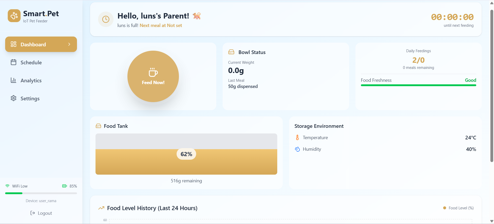
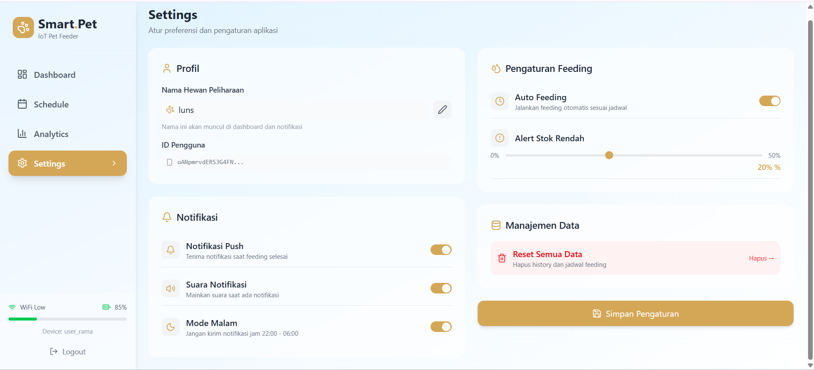
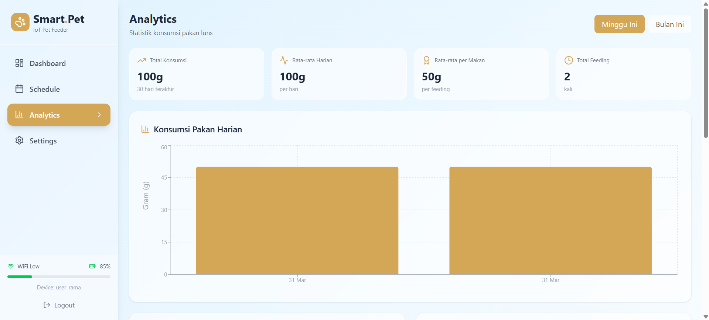
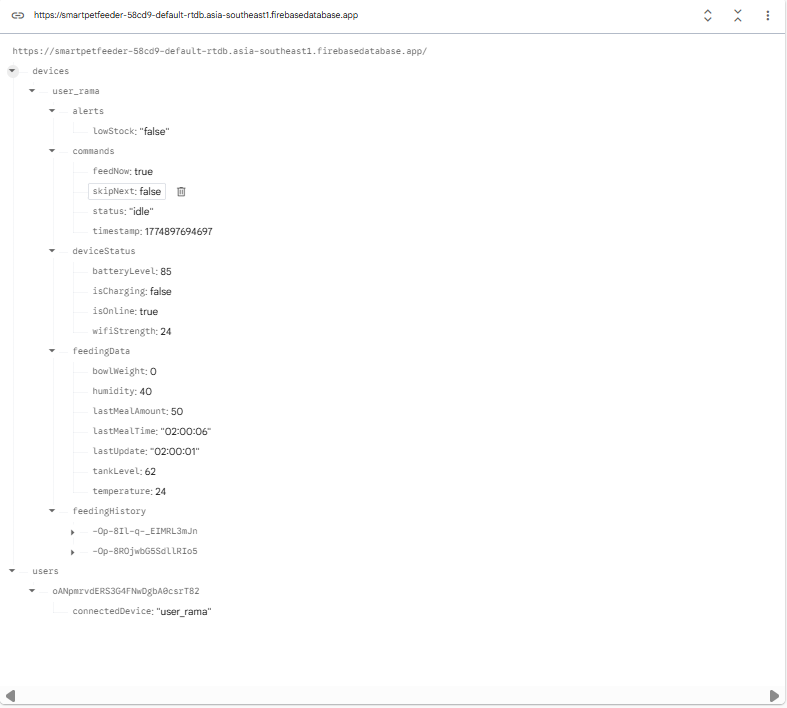
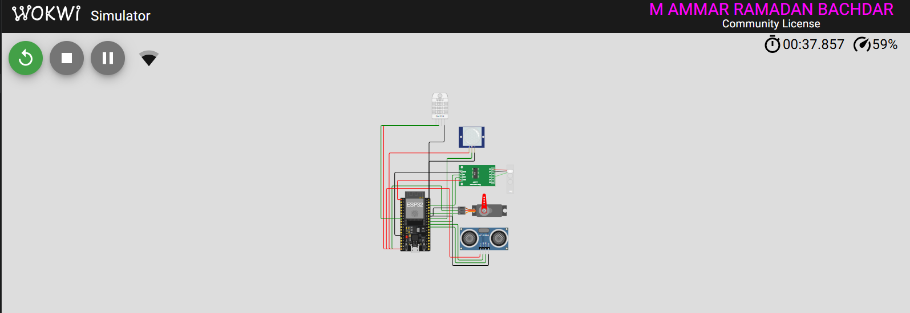

# SmartPetFeeder v1.0 · IoT Cloud Solution

Proyek **Smart Pet Feeder IoT** untuk bantu kasih makan hewan peliharaan lebih tepat waktu, bisa dipantau dari mana saja, dan tetap nyaman dipakai harian.

<p align="center">
  
</p>

## Tentang Proyek

Kadang jadwal makan pet telat karena rutinitas yang padat.  
SmartPetFeeder v1.0 hadir sebagai solusi: perangkat feeder terhubung ke cloud, bisa dijadwalkan otomatis, dipantau real-time, dan tetap bisa trigger manual dari web.

## Fitur Utama

### 1) Monitoring Real-time
- Pantau kondisi perangkat langsung dari dashboard:
  - berat pakan (load cell + HX711)
  - suhu & kelembaban (DHT22)
  - level pakan di tangki (Ultrasonik)
  - status feeder & baterai
- Semua data sinkron ke Firebase dan tampil live di frontend.

<p align="center">
  
</p>

### 2) Penjadwalan Pintar (Smart Scheduling)
- Jadwal makan otomatis dari data schedule di database.
- Firmware melakukan pengecekan berkala agar jadwal tidak mudah terlewat.
- Ada proteksi anti double-trigger supaya jadwal yang sama tidak jalan berulang.
- Cooldown 5 menit setelah manual feed agar jadwal tidak bentrok.

### 3) Analitik
- Riwayat feeding dan statistik konsumsi ditampilkan di halaman analytics.
- Bantu lihat pola makan harian/mingguan.
- Kondisi lingkungan (suhu & kelembaban) ikut dipakai untuk insight kualitas penyimpanan pakan.

<p align="center">
  
</p>

## Dynamic Pairing Multi-user

Sistem pairing sudah dinamis:
- user login disimpan di `users/{userId}`
- device yang terhubung diambil dari `users/{userId}/connectedDevice`
- setelah itu semua data dibaca/ditulis ke `devices/{deviceId}/...`

Jadi tidak tergantung hardcode user tertentu, lebih aman untuk kolaborasi dan scalable untuk banyak user.

<p align="center">
  
</p>

## Arsitektur

| Layer | Teknologi |
| :--- | :--- |
| Frontend | React, Vite, Tailwind CSS, React Router DOM |
| State Management | React Context API (DeviceContext) |
| Auth & Database | Firebase Authentication, Firebase Realtime Database |
| Firmware | ESP32 (Arduino framework), Firebase ESP32 Client |
| Hardware | ESP32, Servo, Load Cell + HX711, PIR, Ultrasonik HC-SR04, DHT22 |

### Struktur Frontend

```
src/
├── context/
│   └── DeviceContext.jsx     → Firebase listener terpusat (satu sumber data)
├── pages/
│   ├── DashboardPage.jsx     → Halaman utama & feed now
│   ├── AnalyticsPage.jsx     → Statistik & grafik konsumsi
│   ├── SchedulePage.jsx      → Manajemen jadwal makan
│   ├── SettingsPage.jsx      → Pengaturan perangkat
│   ├── LoginPage.jsx
│   └── RegisterPage.jsx
├── components/
│   └── layout/
│       └── AppShell.jsx      → Sidebar + routing shell
└── firebase/
    └── config.js
```

### Struktur Firmware

```
firmware/src/
├── Config.h              → Pusat kendali: kredensial, pin & konstanta
├── Sensors.h / .cpp      → HX711, DHT22, Ultrasonik, PIR
├── Actuators.h / .cpp    → Servo (non-blocking)
├── NetworkManager.h/.cpp → WiFi & NTP
├── FirebaseManager.h/.cpp→ Sinkronisasi cloud, jadwal & perintah
└── Main.cpp              → setup() & loop() yang bersih
```

<p align="center">
  
</p>

## Cara Menjalankan

### 1. Clone & install

```bash
git clone https://github.com/<username>/SmartPetFeeder_Project.git
cd SmartPetFeeder_Project
npm install
npm install react-router-dom
```

### 2. Konfigurasi Firebase frontend

Edit `src/firebase/config.js`, isi sesuai project Firebase kamu:
- apiKey
- authDomain
- databaseURL
- projectId
- storageBucket
- messagingSenderId
- appId
- measurementId

### 3. Konfigurasi firmware ESP32

Edit `firmware/src/Config.h`, isi sesuai environment kamu:

```cpp
#define WIFI_SSID     "YOUR_WIFI_NAME"
#define WIFI_PASSWORD "YOUR_WIFI_PASSWORD"

#define FIREBASE_HOST "YOUR_PROJECT.firebasedatabase.app"
#define FIREBASE_AUTH "YOUR_DATABASE_SECRET"

#define DEVICE_ID     "YOUR_DEVICE_ID"
```

### 4. Build & upload firmware

Buka folder `firmware/` di VS Code dengan PlatformIO, lalu:
- **Build:** `Ctrl+Shift+P` → PlatformIO: Build
- **Upload:** `Ctrl+Shift+P` → PlatformIO: Upload
- Atau gunakan Wokwi simulator untuk testing tanpa hardware.

### 5. Jalankan web app

```bash
npm run dev
```

### 6. Pair user ke device

Set `users/<uid>/connectedDevice` dengan `deviceId` yang dipakai firmware, atau klik tombol **"Hubungkan Alat"** di halaman Dashboard.

---
